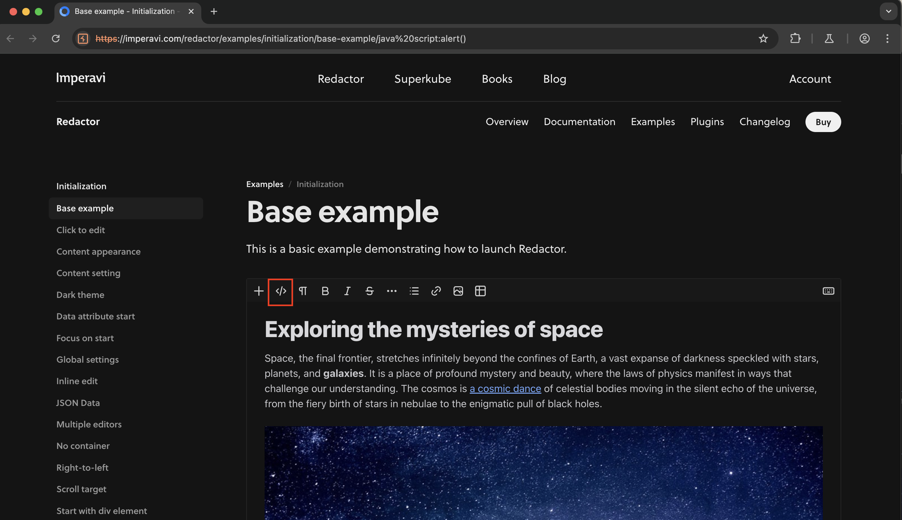
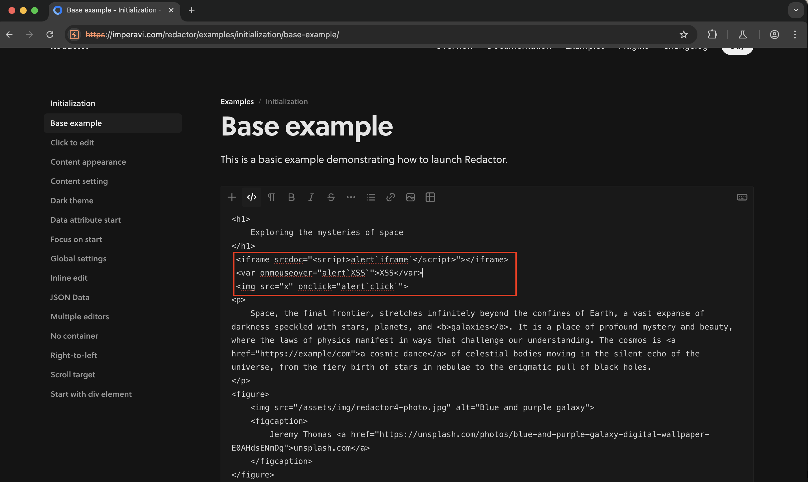
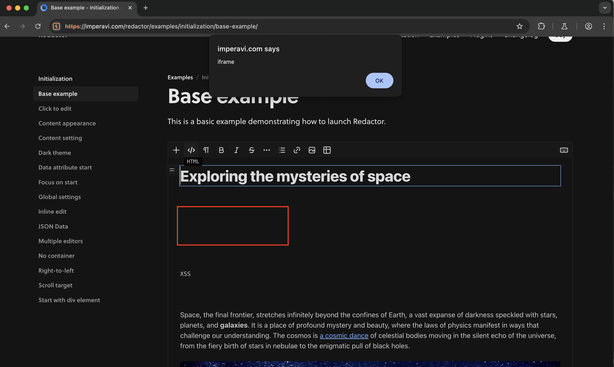
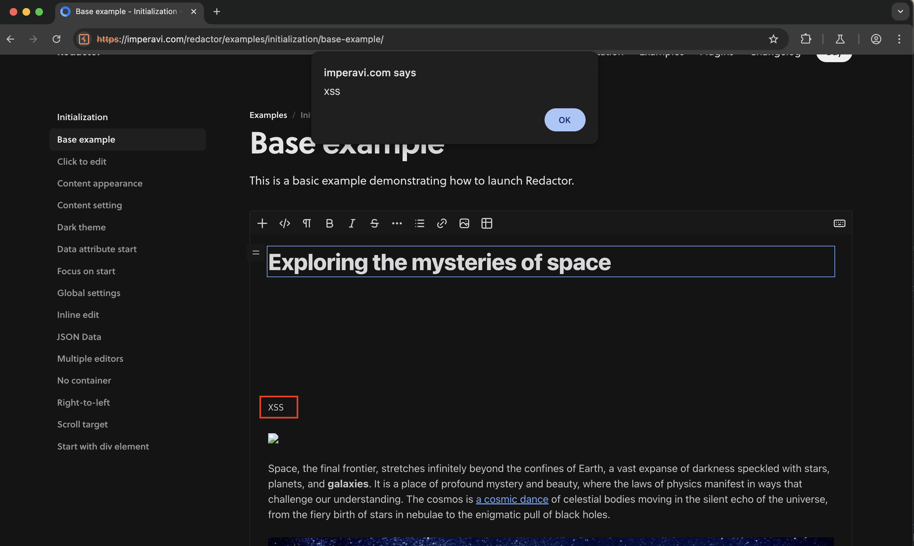
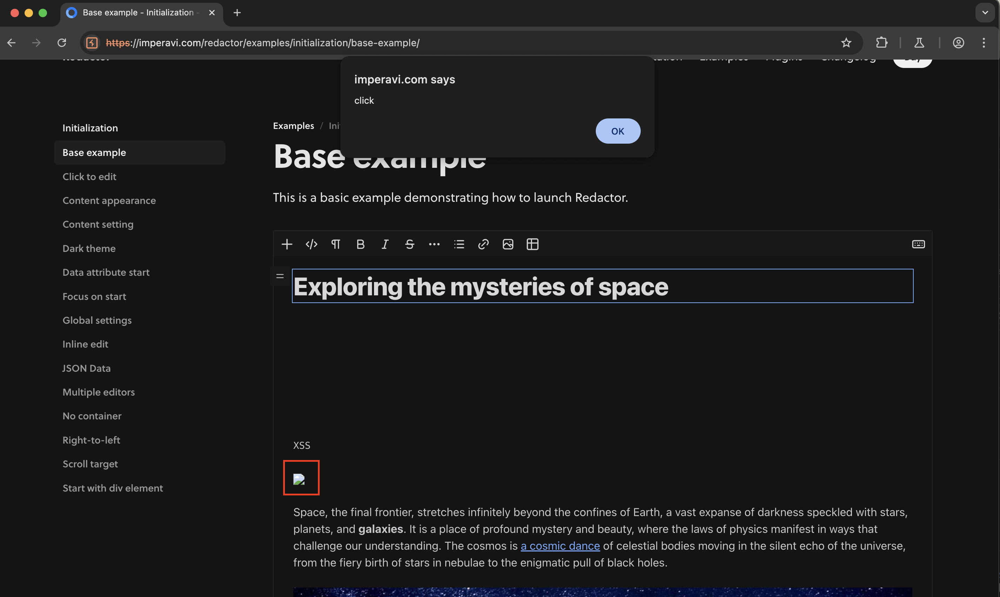

# Redactor JS 4 XSS
This repository documents the vulnerability details and exploit for [Redactror JS](https://imperavi.com/redactor/) 4 and prior versions.

## Metrics
- [CWE-79: Improper Neutralization of Input During Web Page Generation ('Cross-site Scripting')](https://cwe.mitre.org/data/definitions/79.html)
- [CVSS: 6.1 (MEDIUM)](https://nvd.nist.gov/vuln-metrics/cvss/v3-calculator?vector=AV:N/AC:L/PR:N/UI:R/S:C/C:L/I:L/A:N&version=3.1)

## Vulnerability Overview
This Proof of Concept (POC) demonstrates the exploitation of an XSS vulnerability discovered by me recently in the [Redactror JS](https://imperavi.com/redactor/)  WYSIWYG editor, which affects all versions of Redactor JS 4 and its prior versions. The library fails to sanitize various tags, attributes and event handlers, which allows JavaScript execution within the editor.

## Prerequisites
1. **Redactor JS (version <= 4.\*.\*)**: <https://imperavi.com/redactor/examples/initialization/base-example/>

## Reproduction Steps
This vulnerability can be tested using the latest version of Redactor JS 4 instance present [here](https://imperavi.com/redactor/examples/initialization/base-example/).

To test this vulnerability using Redactor JS 3 instead, navigate [here](https://7ragnarok7.github.io/Redactor-JS-3-XSS/demo/).

1. **Switch to Source/HTML mode and insert payloads**:
   - Open the Redactor JS instance and click on the "HTML" icon.
   - Insert the following payloads in the text area:

     ```html
     <iframe srcdoc="<script>alert`iframe`</script>"></iframe>
     <var onmouseover="alert`XSS`">XSS</var>
     
     ```
     

     
     
 2. **Switch to WYSIWYG Mode**:
    - Click on the "HTML" icon again to switch back to the WYSIWYG mode.
   
    - Observe the `<iframe>` tag payload getting triggered automatically.
     
      
     
    - Observe the custom `<var>` tag payload getting triggered after hovering the mouse over the `XSS` text.
     
      
     
    - Observe the `` tag payload getting triggered after clicking on the broken image icon.
     
      
   
## Advisory
Update to the latest version.

## Important Links
- <https://imperavi.com/redactor/>
- <https://imperavi.com/redactor/examples/initialization/base-example/>
- <https://7ragnarok7.github.io/Redactor-JS-3-XSS/>
